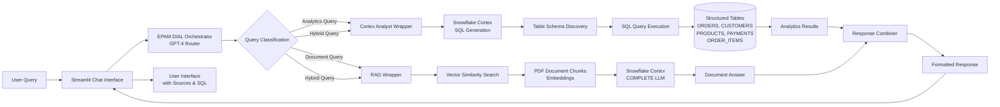

# CRH EKO-AI 2 - Unified Query System

A comprehensive AI-powered query system that intelligently routes user questions to either structured data analytics (Cortex Analyst) or unstructured document search (RAG), or both, using an EPAM DIAL orchestrator.

## System Architecture



**Full architecture diagram:** See `architecture_diagram.mmd` for the complete Mermaid diagram.

## System Components

### 1. **EPAM DIAL Orchestrator**
- Uses GPT-4 to intelligently route queries
- Routes to: Cortex Analyst, RAG, or Both
- Provides routing reasoning and confidence scores

### 2. **Cortex Analyst** (Structured Data)
- Natural language to SQL generation
- Queries structured tables: ORDERS, CUSTOMERS, PRODUCTS, PAYMENTS, ORDER_ITEMS
- Automatic table schema discovery
- Returns formatted analytics results

### 3. **RAG System** (Unstructured Documents)
- Vector similarity search over PDF documents
- Semantic document retrieval
- Context-aware answer generation
- Source citation and references

### 4. **Streamlit UI**
- Modern chat interface
- Real-time query processing
- Visual routing indicators
- Source and SQL query display

## Quick Start

### Prerequisites
- Python 3.11+
- Snowflake account with Cortex enabled
- EPAM DIAL API access

### Installation

1. **Clone and navigate to the project:**
```powershell
cd C:\DS_Training\CRH_POC
```

2. **Create virtual environment:**
```powershell
python -m venv .venv
.venv\Scripts\Activate.ps1
```

3. **Install dependencies:**
```powershell
pip install -r requirements.txt
```

4. **Configure environment:**
   - Copy `env.example` to `.env`
   - Fill in your Snowflake credentials
   - EPAM DIAL API key is already configured (can be overridden in `.env`)

## Snowflake Connection Setup

Follow these steps to connect your Snowflake account and verify the connection from this workspace.

### 1) Create your environment file
1. Duplicate `env.example` to `.env` (same folder).
2. Fill in values from your Snowflake account:
   - `SNOWFLAKE_ACCOUNT` (e.g., `xy12345.us-east-1`)
   - `SNOWFLAKE_USER`
   - `SNOWFLAKE_PASSWORD`
   - `SNOWFLAKE_ROLE`
   - `SNOWFLAKE_WAREHOUSE`
   - `SNOWFLAKE_DATABASE`
   - `SNOWFLAKE_SCHEMA`

### 2) Install dependencies
On Windows PowerShell:

```powershell
cd C:\DS_Training\CRH_POC
python -m venv .venv
.venv\Scripts\Activate.ps1
pip install -r requirements.txt
```

### 3) Test the connection

```powershell
python .\snowflake_connect.py
```

Expected output:
```
Connected to Snowflake. Current version: X.Y.Z
```

### Using in your code
Import and reuse the connection:

```python
from snowflake_connect import connect_snowflake

with connect_snowflake() as conn:
    with conn.cursor() as cur:
        cur.execute("SELECT CURRENT_DATABASE(), CURRENT_SCHEMA()")
        print(cur.fetchone())
```

## RAG over PDFs using Snowflake Cortex

This project includes a minimal RAG pipeline that:
- Stores PDF chunks and embeddings in Snowflake
- Retrieves top-k chunks via vector similarity
- Calls Snowflake Cortex COMPLETE to generate answers with sources

### 1) Ensure dependencies are installed
```powershell
cd C:\DS_Training\CRH_POC
. .\.venv\Scripts\Activate.ps1
pip install -r requirements.txt
```

### 2) Run SQL setup in Snowflake
Execute:

```powershell
python .\run_sql_file.py sql\\rag_setup.sql
```

This creates `PDF_DOC_CHUNKS` with a vector index in `LEARNING_DB.ECOMMERCE`.

### 3) Add your PDFs
Place PDFs under `PDF Data/` (create the folder if it doesn't exist).

### 4) Ingest PDFs
```powershell
python .\ingest_pdfs.py
```
This reads each PDF, chunks text, inserts rows, and computes embeddings using Snowflake Cortex.

### 5) Ask questions
```powershell
python .\rag_query.py "What are the key findings?"
```
Outputs the answer and source chunk references.

Notes:
- Embedding model used: `e5-base-v2` via `SNOWFLAKE.CORTEX.EMBED_TEXT_768`.
- Generation model used: `snowflake-arctic` via `SNOWFLAKE.CORTEX.COMPLETE`.
- Adjust K, chunk size, models as needed in `ingest_pdfs.py` and `rag_query.py`.

## Unified Query System (Streamlit Interface)

The main interface that integrates all components with intelligent query routing.

### Starting the Application

**Option A: Using the batch file (Windows)**
```powershell
.\run_streamlit.bat
```

**Option B: Using Python directly**
```powershell
python -m streamlit run streamlit_app.py
```

### Access the Interface

The app will automatically open in your default browser, or navigate to:
- **Local URL:** http://localhost:8501

### Features

- 🤖 **Intelligent Routing** - EPAM DIAL orchestrator automatically routes queries
- 📊 **Analytics Queries** - Natural language queries on structured data (orders, customers, products)
- 📄 **Document Queries** - Search and query PDF documents using RAG
- 🔀 **Hybrid Queries** - Combine insights from both structured and unstructured data
- 📚 **Source Citations** - View document sources and generated SQL queries
- ⚙️ **Configurable Settings** - Adjust context chunks (K) and view routing decisions
- 🎨 **Modern UI** - Clean, user-friendly chat interface

### Usage Examples

**Analytics Query:**
```
"What are the top 5 customers by total order value?"
```
→ Routed to: **Cortex Analyst** (generates and executes SQL)

**Document Query:**
```
"What does the sustainability report say about carbon emissions?"
```
→ Routed to: **RAG System** (searches PDF documents)

**Hybrid Query:**
```
"Compare our sales data with what the earnings report mentions"
```
→ Routed to: **Both Systems** (combines analytics and document insights)

### Interface Features

1. **Chat Input** - Type your question at the bottom
2. **Routing Indicator** - See which system(s) handled your query
3. **Routing Reasoning** - Expand to see why the orchestrator chose that route
4. **Document Sources** - View which PDF chunks were used (for RAG queries)
5. **Analytics Results** - View generated SQL and data tables (for Cortex Analyst queries)
6. **Settings Sidebar** - Configure K value and view connection status

### Stop the Server

Press `Ctrl+C` in the terminal where Streamlit is running.

## Cortex Analyst (Structured Data)

Query structured tables using natural language. The system automatically generates SQL queries.

### Setup

1. **Ensure table relationships are configured:**
   - File: `cortex_analyst_relationships.yaml`
   - Defines relationships between ORDERS, CUSTOMERS, PRODUCTS, PAYMENTS, ORDER_ITEMS

2. **Test Cortex Analyst:**
```powershell
python cortex_analyst_final.py
```

### Features
- Automatic SQL generation from natural language
- Table schema discovery
- Relationship-aware queries
- Formatted result tables

## RAG System (Unstructured Documents)

Search and query PDF documents using semantic search and LLM generation.

### Setup

1. **Run SQL setup:**
```powershell
python .\run_sql_file.py sql\\rag_setup.sql
```

2. **Add PDFs:**
   - Place PDFs in `PDF Data/` folder

3. **Ingest PDFs:**
```powershell
python .\ingest_pdfs.py
```

4. **Query documents:**
```powershell
python .\rag_query.py "What are the key findings?"
```

### Features
- Vector similarity search
- Semantic document retrieval
- Clean, natural language answers (no chunk references)
- Source citations available in expandable sections

## Project Structure

```
CRH_POC/
├── streamlit_app.py              # Main Streamlit UI with orchestrator
├── orchestrator.py                # EPAM DIAL query router
├── cortex_analyst_wrapper.py     # Cortex Analyst integration
├── rag_wrapper.py                 # RAG system integration
├── cortex_analyst_final.py        # Standalone Cortex Analyst script
├── rag_query.py                   # RAG query functions
├── snowflake_connect.py           # Snowflake connection utilities
├── ingest_pdfs.py                 # PDF ingestion script
├── cortex_analyst_relationships.yaml  # Table relationships config
├── architecture_diagram.mmd       # System architecture diagram
├── requirements.txt               # Python dependencies
├── .env                           # Environment variables (not in git)
├── env.example                    # Environment template
├── PDF Data/                      # PDF documents directory
└── sql/                           # SQL setup scripts
```

## Configuration

### Environment Variables (.env)

```env
# Snowflake Configuration
SNOWFLAKE_ACCOUNT=your_account
SNOWFLAKE_USER=your_username
SNOWFLAKE_PASSWORD=your_password
SNOWFLAKE_ROLE=ACCOUNTADMIN
SNOWFLAKE_WAREHOUSE=COMPUTE_WH
SNOWFLAKE_DATABASE=LEARNING_DB
SNOWFLAKE_SCHEMA=ECOMMERCE

# EPAM DIAL (optional - defaults provided)
DIAL_API_KEY=dial-j7r9nwg4xmk9spkibd3xrp4hjdg
```

## Query Routing Logic

The orchestrator uses GPT-4 to analyze query intent:

- **Analytics Keywords** → Cortex Analyst
  - Examples: customer, order, product, revenue, sales, total, count, top, highest
  
- **Document Keywords** → RAG
  - Examples: report, document, PDF, sustainability, earnings, transcript, findings
  
- **Mixed Keywords** → Both Systems
  - Combines structured data with document insights

## Technical Details

### Models Used
- **Orchestrator:** GPT-4 (EPAM DIAL)
- **SQL Generation:** llama3-8b, mistral-7b, snowflake-arctic
- **Document Q&A:** llama3-8b, mistral-7b, mixtral-8x7b, snowflake-arctic
- **Embeddings:** e5-base-v2 (768 dimensions)

### Data Sources
- **Structured:** ORDERS, CUSTOMERS, ORDER_ITEMS, PRODUCTS, PAYMENTS tables
- **Unstructured:** PDF documents in `PDF Data/` directory

## Troubleshooting

### Connection Issues
- Verify `.env` file has all required Snowflake credentials
- Test connection: `python snowflake_connect.py`

### Routing Issues
- Check EPAM DIAL API key is valid
- Review routing reasoning in the UI
- Fallback keyword-based routing will activate if LLM fails

### Query Errors
- **Analytics:** Verify tables exist and relationships are configured
- **Documents:** Ensure PDFs are ingested (`python ingest_pdfs.py`)
- Check Snowflake Cortex is enabled in your account

## License

This project is part of the CRH POC initiative.
